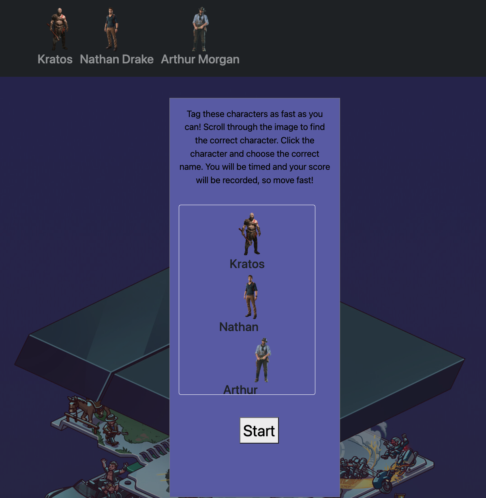

# Game & Seek (Photo Tagging App - Where's Waldo?)

## Summary:

The goal of the project is to create a 'Wheres Waldo' type of game that incorporates a backend. Players select a level and must find 3 hidden characters. The characters coordinates are used to identify their location in the level, selecting the correct coordinates (along with the character) will mark a character as found. Firebase is used as a backend to store the game data & highscores for each level. This project as made with the React JS Library, CSS, and Firebase.

## Technologies:
  <ul>
  <li>ReactJS</li>
  <li>CSS</li>
  <li>Firebase</li>
 </ul>

## Features:

- Use of firebase-firestore for a live back end database
- Explitive usernames submitted to the leaderboard are censored
- Responsive Design

## Screenshots
&nbsp;&nbsp;&nbsp;
